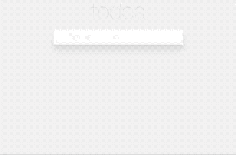

# Adopting GraphQL: Todo MVC



Example Todo MVC apps showing how to gradually adopt GraphQL.

## Getting started

### Setting up everything

* Clone repository: `git clone git@github.com:GraphQLCollege/from-rest-to-graphql-node-react.git`
* Install lerna: `yarn install`
* Install all repositories' dependencies: `npx lerna bootstrap`

### Run app

* Go to a client folder, e.g. `todo-graphql-client`: `cd packages/todo-graphql-client`
* Start client and server: `yarn start-all`

### Run tests

* Go to a client folder, e.g. `todo-graphql-client`: `cd packages/todo-graphql-client`
* Run tests: `yarn test`

## Folder structure

This repository uses [lerna](https://github.com/lerna/lerna) to manage all sub-repositories.

```
packages
└─ todo-todo-end-to-end-tests
└─ todo-rest-api
└─ todo-graphql-gateway
└─ todo-graphql-api
└─ todo-components
└─ todo-rest-client
└─ todo-graphql-client
└─ todo-apollo-graphql-client
└─ todo-apollo-graphql-rest-client
```

## Servers

* REST API: Express REST API
* GraphQL Gateway: GraphQL proxy in front of the REST API
* GraphQL API: Standalone GraphQL server

## Clients

* REST: Components that retrieve data from a REST API using `fetch`
* GraphQL: Components that retrieve data from a GraphQL API using `fetch`
* Apollo GraphQL REST client: GraphQL queries that fetch data from a REST API using apollo-link-rest
* Apollo GraphQL: Pure Apollo GraphQL client which can retrieve data either from GraphQL API or from GraphQL gateway

## End to end tests

There is an end to end testing suite which you can use to test any client. They are written using [cypress](cypress.io). Try them out by running `yarn test` in any client folder.
